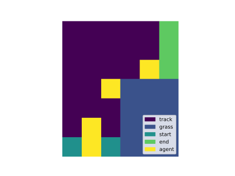
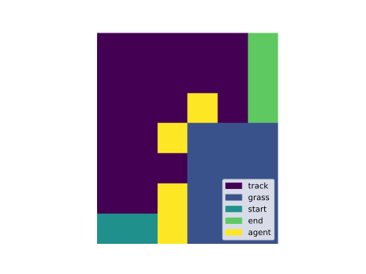
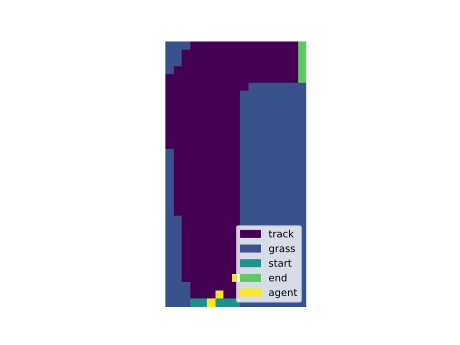
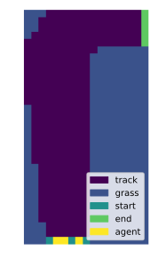

# Monte Carlo #

This is an implementation of the Racetrack environment and the Monte Carlo agent described in Sutton and Barto's 
Reinforcement Learning: An Introduction, Chapter 5. My agent can solve the problem posed in the book and I further 
experiment with increasing the difficult of the environment.

## Environment ##

The book recommends two environments (the 2nd and 3rd picture), I added one more for debugging.
The third environment is bigger than the second one but is in fact easier to solve.

The race car starts at the bottom and should move to the finish, which is in the top right corner, as fast as possible.

<p float="left">
  
  
  
</p>

```
for track in track_1 track_2 track_3;
  do python -m scripts.show_racetrack "$track" --save-path "images/$track.svg";
done
```

## Results ##

### Original Problem ###

In the original problem, the car is penalized when it attempts to leave the track but the episode does not terminate.
Instead, the car is placed back on the track and the environment makes sure that the car always moves by at least one square towards the finish.
Moreover, the car can only move to the top and to the right.
To make it harder, the car's position is randomly shifted up or right by one square with a probability of 50%.

A (tabular) Monte Carlo agent can successfully solve this task after 50000 training episode. I show three testing episodes
for each of the environments below.

The agent learn the drive in all three tracks. However, it sometimes gets penalized for driving off the track
because of the random noise added to the car's position.

<p float="left">
  
  
  
</p>

```
python -m scripts.solve_racetrack track_1 0.1 --save-path images/track_1_episode
```

<p float="left">
  
  
  
</p>

```
python -m scripts.solve_racetrack track_2 0.1 --save-path images/track_2_episode
```

<p float="left">
  
  
  
</p>


```
python -m scripts.solve_racetrack track_3 0.1 --save-path images/track_3_episode
```

### Strict Version ###

The strict version of the environment terminates the episode when the car attempts to leave the track. Unlike the original problem,
the car almost never reaches the finish line. I disabled the random noise added to the car's position because
the environment is already difficult to solve.

The first tack is still easy to solve.

<p float="left">
  
  
  
</p>

```
python -m scripts.solve_racetrack track_1 0.1 --save-path images/track_1_strict_episode --strict
```

However, the agent always terminates the episode as early as possible in the second track. This happens because
the agent almost never reaches the finish line during training, even with 100% exploration (ε=1.0).

<p float="left">
  
  
  
</p>

```
python -m scripts.solve_racetrack track_2 0.1 --save-path images/track_2_strict_episode --strict
python -m scripts.solve_racetrack track_2 0.5 --save-path images/track_2_strict_eps_0.5_episode --strict
python -m scripts.solve_racetrack track_2 1.0 --save-path images/track_2_strict_eps_1.0_episode --strict
```

Even though the third track is bigger, it is much more likely that the agent will reach the finish by taking random actions.
The trained agent usually reaches the finish line but the learned policy is not perfect, as you can see in the second picture.


```
python -m scripts.solve_racetrack track_3 0.1 --save-path images/track_3_strict_episode --strict
```

## Setup ##

Install Python3 and all Python packages listed in **requirements.txt**.

## Usage ##

The environments are implemented in **environment.py** and the agent in **agent.py**. You can replicate all the 
plots by running the commands listed under them.