# Monte Carlo #

This is an implementation of a Racetrack environment and a Monte Carlo agent described in Sutton and Barto's 
Reinforcement Learning: An Introduction, Chapter 5. My agent can solve the problem posed in the book and I further 
experiment with increasing the difficult of the environment.

## Environment ##

The book recommends two environments (the 2nd and 3rd picture), I added one more for debugging.
The third environment is bigger than the second one but is in fact easier to solve.

The race car starts at the bottom and should move to the finish, which is in the top right corner, as fast as possible.

<p float="left">
  
  
  
</p>

```
for track in track_1 track_2 track_3;
  do python -m scripts.show_racetrack "$track" --save-path "images/$track.svg";
done
```

## Original Problem ##

In the original problem, the car is penalized when it attempts to leave the track but the episode does not terminate.
Instead, the car is placed back on the track and the environment makes sure that the car always moves by at least one square towards the finish.
Moreover, the car can only move to the top and to the right.

A Monte Carlo agent can successfully solve this task after 50000 training episode. I show three testing episodes
for each of the environments below.

<p float="left">
  
  
  
</p>


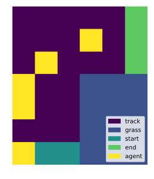
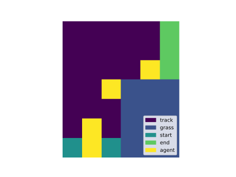
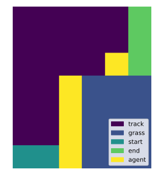

```
python -m scripts.solve_racetrack track_1 0.1 --save-path images/track_1_episode
```

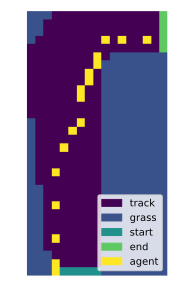
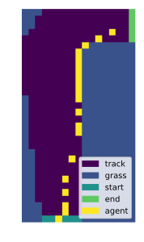
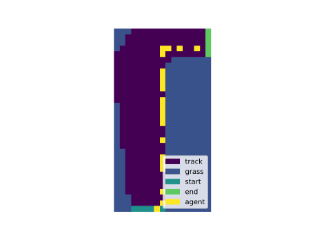

```
python -m scripts.solve_racetrack track_2 0.1 --save-path images/track_2_episode
```

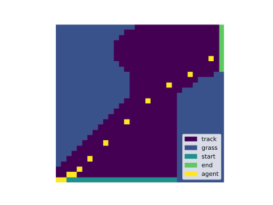
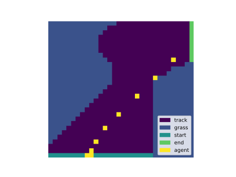
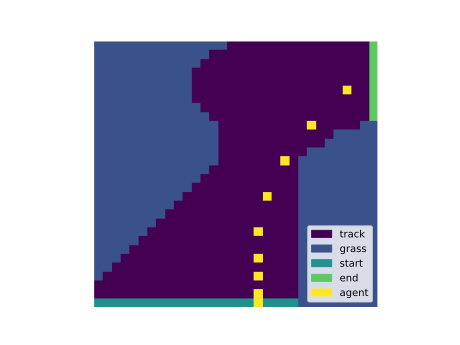

```
python -m scripts.solve_racetrack track_3 0.1 --save-path images/track_3_episode
```

## Strict Version ##

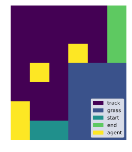

```
python -m scripts.solve_racetrack track_1 0.1 --save-path images/track_1_strict_episode --strict
```


```
python -m scripts.solve_racetrack track_2 0.1 --save-path images/track_2_strict_episode --strict
python -m scripts.solve_racetrack track_2 0.5 --save-path images/track_2_strict_eps_0.5_episode --strict
python -m scripts.solve_racetrack track_2 1.0 --save-path images/track_2_strict_eps_1.0_episode --strict
```

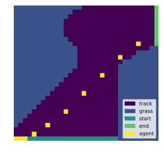
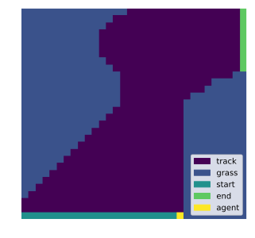

```
python -m scripts.solve_racetrack track_3 0.1 --save-path images/track_3_strict_episode --strict
```